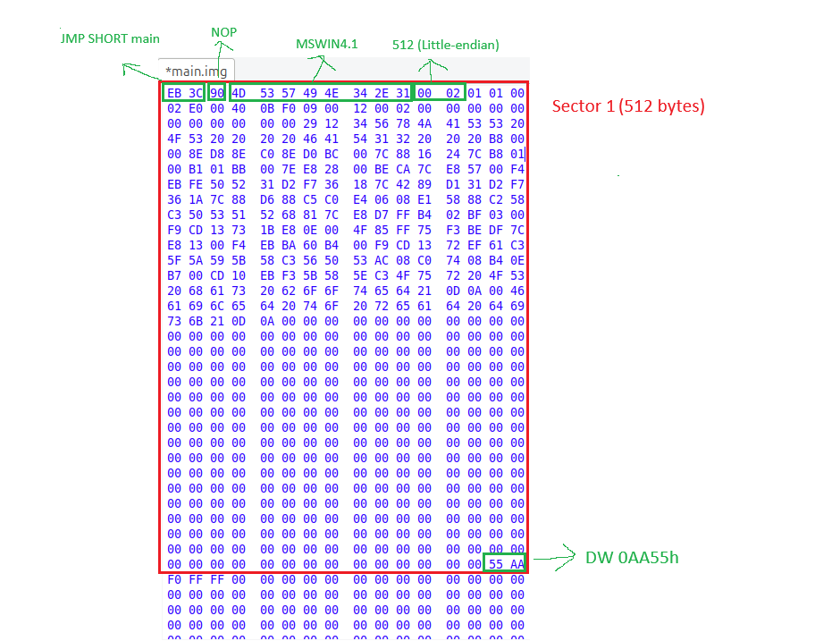

1. 
```bash
make
```

2. 
```bash
qemu-system-i386 -fda build/main.img
# or
qemu-system-i386 -fda build/main.img -nographic -serial mon:stdio
```

3. if use -nographic -serial mon:stdio
to quit the qemu press `CTRL+A` and then press `X`

## Memory Layout

記憶體位址 (高)
      |
0xFFFF +---------------------------+
       |                           |
       |      BIOS / 系統保留區     |
       |                           |
0x8000 +---------------------------+
       |                           |
       |     從磁碟讀入的資料      |  <-- 也就是你讀取的 Sector 2 (BX=0x7E00)
       |   (例如: Kernel 程式碼)   |      這部分是往高位址方向存放 (Up)
       |                           |
0x7E00 +---------------------------+
       |                           |
       |   Bootloader 程式碼本體   |  <-- 你的 512 Bytes (0x7C00 ~ 0x7DFF)
       |    (主程式、BPB、簽名)     |      這是由 BIOS 幫你載入的
       |                           |
0x7C00 +===========================+  <--- SP (Stack Pointer) 起點
       |             |             |
       |    堆疊區   | 往下長      |  <-- PUSH, CALL 時，資料會往低位址寫
       |   (Stack)   v             |      (例如 0x7BFE, 0x7BFC...)
       |                           |
0x0500 +---------------------------+
       |    BIOS 數據 / 中斷向量表  |
0x0000 +---------------------------+
記憶體位址 (低)

### x86 Div

除數大小 (Divisor),被除數位置 (Dividend),商存放處 (Quotient),餘數存放處 (Remainder)
8-bit (例如 div bl),AX,AL,AH
16-bit (例如 div cx),DX:AX,AX,DX
32-bit (例如 div ecx),EDX:EAX,EAX,EDX

### IMG File Hex Layout
- 使用**jeex**打開`build/main.img`後如下圖

- `ORG 0x7C00`和`BITS 16`是 **「組譯器虛擬指令」（Assembler Directives）**，它們的作用是告訴組譯器（NASM）「該如何編譯」後面的程式碼，而不是「要編譯出什麼」程式碼，所以不會被編譯到`bootloader.bin`裡